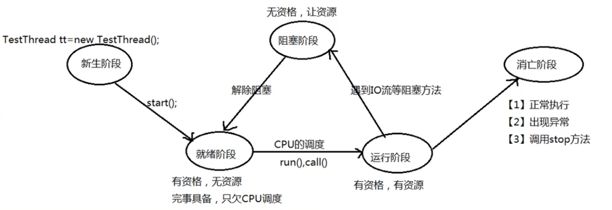

# 程序？进程？线程？

## 概念

- 程序
- 进程：程序启动后就是一个进程
- 线程：线程是进程下的任务
- 栗子🌰：网易云音乐是一个程序，启动后就变成了一个进程，音乐播放和歌词显示是该进程下的两个线程

## 创建（子）线程的三种方式

1. 继承类Thread，覆写run方法：`TestThreadOne.java`
2. 实现Runnable接口：`TestThreadTwo.java`
   1. 这里面用到的设计模式：静态代理模式
3. 实现Callable接口：`TestThreadThree.java`
   1. JDK1.5之后才出现
   2. 引入了FutureTask
   3. 线程可以有返回值，并且能抛异常

## 线程的生命周期

### 影响生命周期的方法

1. setPriority()
   1. 优先级从1..10依次从低到高
   2. 优先级高 -> 只能说明优先被CPU调度的概率高，!= 一定被优先调度
2. join()
   1. 通过childThread.join()让其他线程等当前线程执行完之后再执行
3. sleep()
   1. 模拟方法执行之间需要的时间差

## References

- https://www.bilibili.com/video/BV1js411p7dV?p=7&spm_id_from=pageDriver&vd_source=363785c27139bc5fd74d171f7bc5772e