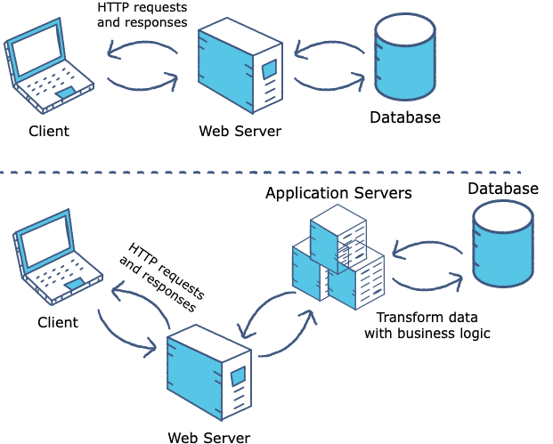

# Web & Application Server, Servlet Container, Tomcat

## Web Server vs Application Server

## Servlet/Web Container

Part of a Web/Application Server, responsible for dealing with network services over which requests and responses are sent

## Install Tomcat on Mac

Tomcat 是支持Servlet Container的Web Server.

[Reference](https://professionalhacker.in/how-to-install-tomcat-on-mac/)

